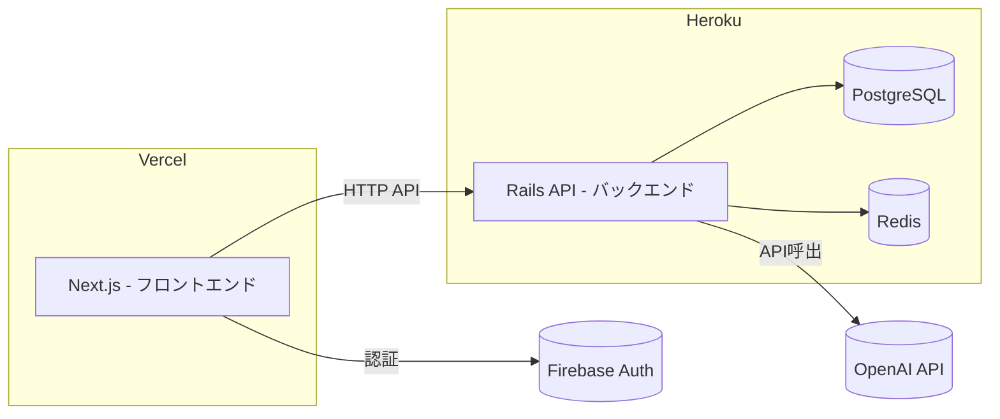

# FamDish

## 1. プロジェクト概要（Overview）

FamDish は、家庭の料理・在庫管理・献立提案を支援するWebアプリです。

家族メンバーの好み・嫌いな食材・冷蔵庫の在庫などをもとに、AIがパーソナライズされたレシピを自動生成します。

## 2. デモ（Demo）

🌐 本番URL: https://app.famdish.jp

- `/docs` に短い GIF やスクリーンショットを置いています

## 3. 開発背景・課題（Background）

日々の食事において以下の課題を感じていました。

- 献立を考えるのが面倒(何を食べたいか聞いても【何でもいい】だと困る)
- 食材ロスが発生している(冷蔵庫の中身を腐らせて困る)
- 食べたい料理が食卓に出てこない(食べたくない料理が出てきて困る)

これらを解決するために本サービスを開発しました。

## 4. 主な機能（Features）

- ユーザー認証（ログイン / 新規登録）
- 家族単位での共有機能(家族招待機能)
- 家族の好き嫌い登録機能
- 食材在庫管理機能
- 献立提案機能（AI）
- 料理の作り方提案機能(AI)
- プロフィール管理

## 5. 技術スタック（Tech Stack）

### フロントエンド

- Next.js
- React
- Node.js

### バックエンド

- Ruby on Rails (APIモード)

### インフラ

- Docker / Docker Compose
- Vercel
- Heroku(PostgreSQL, Redis含む)
- AWS Certificate Manager (ACM)
- Amazon Route 53
- SendGrid

#### 常時稼働しないインフラサービス

- Amazon VPC
- AWS NAT Gateway
- Application Load Balancer
- Amazon ECS (Elastic Container Service)
- Amazon ECR (Elastic Container Registry)
- Amazon RDS for PostgreSQL
- Amazon ElastiCache for Redis
- AWS Systems Manager
- Interface VPC Endpoint

### その他

- Firebase Authentication（認証）
- OpenAI API (AI基盤)
- RSpec / Jest / Playwright（テスト）

## 全体アーキテクチャ（簡易図）

- フロントとバックエンドを分離（SPA + API構成）
- 認証はFirebaseで実施し、Rails側でトークン検証

## AWS構成図(コスト増のため普段は停止)

## 7. こだわり・工夫した点（Highlights）

- Firebase Authenticationを採用し、セキュアな認証とユーザー登録離脱の最小化を実現しました。
- AI提案機能に、フィードバック機能を追加し、ハルシネーション回避を目指しました。
- Docker環境を構築し、開発者が同じ環境で動作可能にしました。
- API設計をRESTfulに統一しました。

## 8. 苦労した点・課題（Challenges）

- Docker環境のセットアップ
- フロントとバック間の認証連携（JWT検証）
- レスポンシブデザインの導入
- 非同期処理の扱い（useEffectやSolid Queueなど）

## 9. テストと CI/CD（要約）

- テスト方針: テストピラミッドに従い、ユニット > 統合 > E2Eを実装しました。
- E2E: Playwright を使用し、重要フローのみ（主要フロー: 認証 / 投稿 CRUD / 生成AI フロー）をテストしました。
- CI/CD: GitHub Actions で PR とmainブランチにマージするごとにテストを自動実行し、結果はPR欄に反映させました。mainブランチマージでテストに通ったら、自動デプロイされます。

- フロントエンドのCI/CDパイプライン通過

  

- フロントエンドのステートメント・カバレッジは81%

  

- バックエンドのCI/CDパイプライン通過

  

- バックエンドのステートメント・カバレッジは99%

  

## 10. ローカルで全体を起動する（開発者向け）

DockerとVScodeのインストールを最初に行なってください。
※ Windowsの方はWSL2環境が必要です。

### 本リポジトリをクローン

- `git clone https://github.com/YukiYonekura-321/portfolio.git`
- cd portfolio

### フロントとバックエンドのリポジトリをクローン

portfolioディレクトリでフロントとバックエンドのリポジトリをクローンします。

#### フロントエンド (Next.js)を起動

- `git clone https://github.com/YukiYonekura-321/famdish-front-react.git`
- `cp .env.ex .env.local` (環境変数を設定)

#### バックエンド (Rails API)を起動

- `git clone https://github.com/YukiYonekura-321/famdish-backend-rails.git`
- `cp .env.ex .env` (環境変数を設定)

### Docker起動

- `docker compose up --build`

※以下の初期セットアップはentrypoint.shで実行されるため、不要です
docker compose exec backend rails db:create
docker compose exec backend rails db:migrate

### Docker停止

- `docker compose down -v`

### 11. 今後の改善（Future Work）

- 現在はコントローラにロジックを書いている(ファットコントローラ)ので、関数型アーキテクチャでリファクタリングして、壊れにくいテストコードを実装する。
- AIのハルシネーション対策を減少させて、UI/UXを向上させる。
- E2EテストにモックしたRails APIを実装しているので、実APIでテストを通す。
